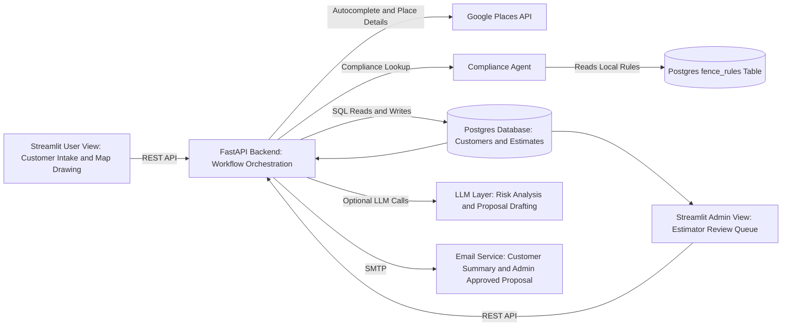
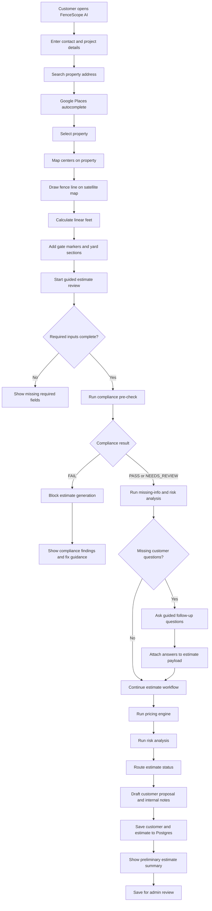
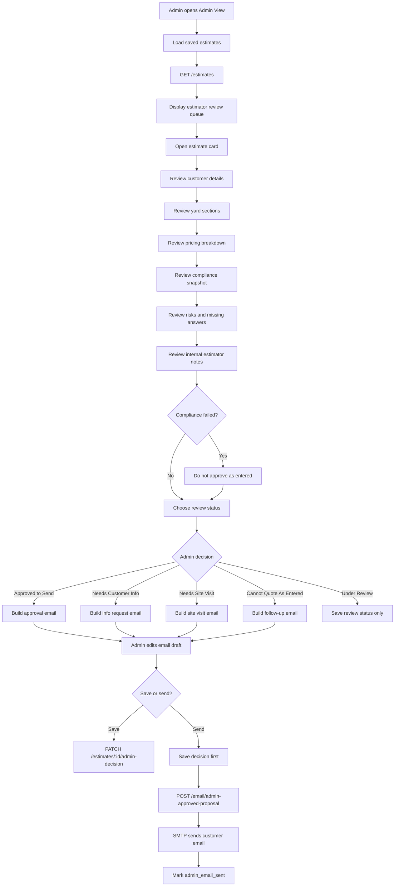
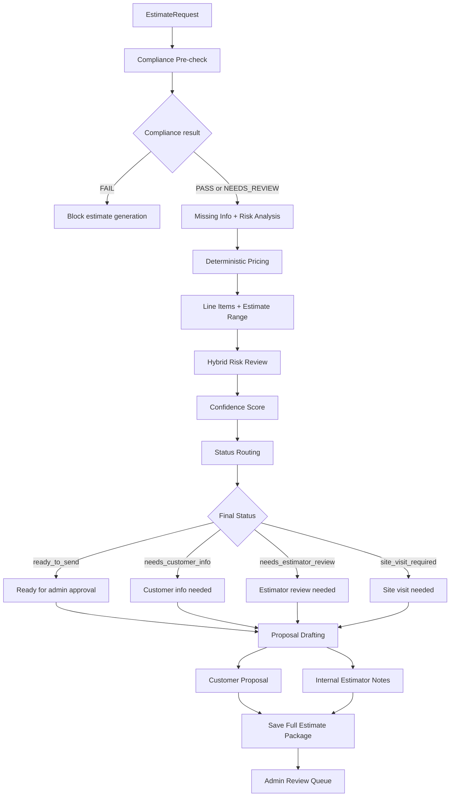

# FenceScope AI

FenceScope AI is an AI-assisted estimate operations workflow for residential fencing companies.

The goal is not to build a generic fence calculator. The goal is to turn a messy residential fence quote process into a structured workflow that captures customer details, measures a proposed fence line, checks local compliance, detects missing information and project risks, generates a preliminary estimate, saves the full estimate history, and routes the job to a human estimator for review.

## Problem

Residential fencing companies often lose time because quote intake is fragmented across phone calls, emails, notes, photos, maps, estimator judgment, local rules, and follow-up questions.

A typical estimator needs to answer questions like:

- What property is this for?
- How many linear feet of fence are needed?
- Is the fence in the front, side, or back yard?
- Does the proposed height trigger local fence rules?
- Are there gates, slope, difficult access, removal, HOA concerns, or pool-code concerns?
- Is this ready to quote, or does it need more customer information or a site visit?
- What should be sent to the customer, and what should stay internal for the estimator?

FenceScope AI turns that into a guided, auditable workflow.

## Solution

FenceScope AI provides a customer-facing intake flow and an estimator-facing admin review queue.

The customer can:

- Enter contact and project details
- Search and select a property address
- Draw the proposed fence line on a satellite map
- Add gate markers and yard-section details
- Run a guided estimate review
- Receive a customer-safe preliminary estimate summary

The estimator/admin can:

- Review saved estimates
- Inspect compliance findings, risks, missing answers, and pricing
- Choose the next operational status
- Edit the customer email draft
- Save the decision or send the customer follow-up email

## System Architecture Flow



## End-to-End Workflow



## Admin Review Flow



## Core Workflow Engine


## Tech Stack

| Layer | Technology |
|---|---|
| Frontend | Streamlit |
| Map UI | Folium, streamlit-folium, Leaflet Draw |
| Address Search | Google Places API |
| Backend | FastAPI |
| Data Models | Pydantic |
| Database | PostgreSQL |
| Persistence | psycopg2, JSONB fields |
| Compliance | Local structured fence rules + compliance agent |
| Pricing | Deterministic Python pricing engine |
| Risk Analysis | Rule-based checks + optional LLM risk analysis |
| Proposal Drafting | LLM proposal agent with fallback template |
| Email | SMTP via Python email service |
| Local Services | Docker Compose for Postgres |

## Key Backend Endpoints

| Endpoint | Purpose |
|---|---|
| `GET /` | Health check and workflow summary |
| `GET /address/autocomplete` | Address autocomplete using Google Places |
| `GET /address/place` | Place details and lat/lng lookup |
| `POST /precheck` | Compliance pre-check before estimate generation |
| `POST /questions` | Missing-info and risk-question analysis |
| `POST /estimate` | Full estimate workflow, database save, and response |
| `GET /estimates` | Admin estimate history |
| `PATCH /estimates/{estimate_id}/admin-decision` | Save estimator review decision and email draft |
| `POST /email/estimate-summary` | Send customer-safe preliminary estimate summary |
| `POST /email/admin-approved-proposal` | Send admin-approved customer proposal email |

## Project Structure

```text
.
├── backend/
│   ├── main.py                  # FastAPI app and API endpoints
│   ├── models.py                # Pydantic request and response models
│   ├── workflow.py              # Estimate workflow orchestration
│   ├── pricing.py               # Deterministic pricing engine
│   ├── risk_agent.py            # Rule-based risk and missing-info analysis
│   ├── llm_risk_agent.py        # Optional LLM risk analysis
│   ├── proposal_agent.py        # Proposal drafting with fallback template
│   ├── validators.py            # Deterministic status routing
│   ├── address_lookup.py        # Google Places integration
│   ├── database.py              # Customer and estimate database schema
│   ├── storage.py               # Database reads and writes
│   └── email_service.py         # SMTP email sending
│
├── compliance/
│   ├── agent.py                 # Compliance checking logic
│   ├── schemas.py               # Compliance input/output contracts
│   ├── db.py                    # fence_rules database connection
│   ├── build_rules.py           # LLM-assisted grounded rule extraction
│   ├── load_to_db.py            # Loads structured rules into Postgres
│   ├── corpus/                  # Source ordinance excerpts
│   └── rules/                   # Structured rule JSON files
│
├── app.py                       # Streamlit user and admin interface
├── docker-compose.yml           # Local Postgres service
├── requirements.txt             # Python dependencies
└── README.md
```
## Example Business Value

FenceScope AI helps a fencing company:

- Reduce manual intake time
- Avoid quoting with missing details
- Catch compliance issues earlier
- Standardize pricing logic
- Route risky jobs to human review
- Create a searchable estimate history
- Improve customer response time
- Separate customer-safe communication from internal estimator notes

## Limitations

This was a 24-hour time constrained project, so there were a few things that I could have done, and can consider doing it in the future!

Current limitations include:

- Compliance rules are limited to loaded jurisdictions
- Local ordinance checks are informational and require human verification
- Map measurements are approximate and should be validated before final quote
- LLM risk analysis and proposal drafting are assistive, not authoritative
- Email sending depends on SMTP configuration
- Customer-side signup and login are not implemented yet
- The application is not fully containerized yet; only Postgres is containerized with Docker Compose, while the Streamlit frontend and FastAPI backend currently run as local development services.
- Production authentication and role-based permissions should be added before real deployment
- Real contractor pricing should be configured per company, region, material, labor rate, and supplier costs

## Future Work

Production improvements would include:

- Real authentication and role-based access control
- Multi-tenant company support
- Full audit logs for every workflow step
- Estimator assignment and queue management
- Photo upload and computer vision site review
- CRM integration
- Calendar scheduling for site visits
- Payment or deposit workflow
- More jurisdictions and automated rule refresh
- Better map editing and fence/gate snapping
- Evaluation suite for risk classification and proposal quality
- Monitoring for latency, cost, failures, and LLM output quality
- Customer portal for follow-up answers and quote status
